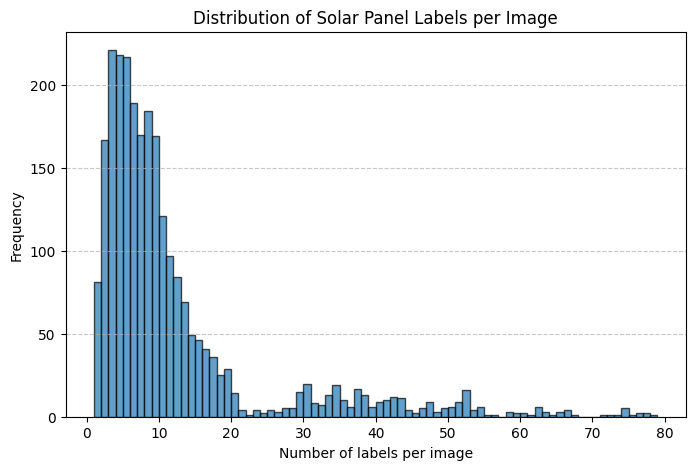
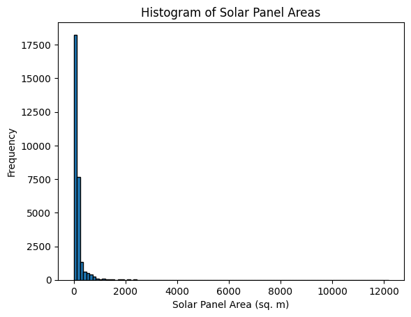
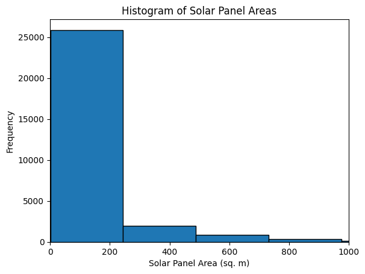
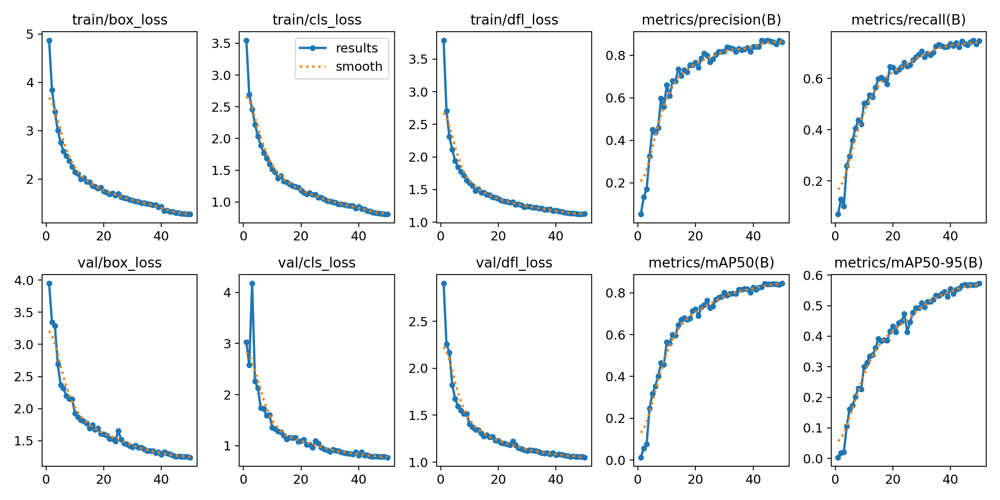
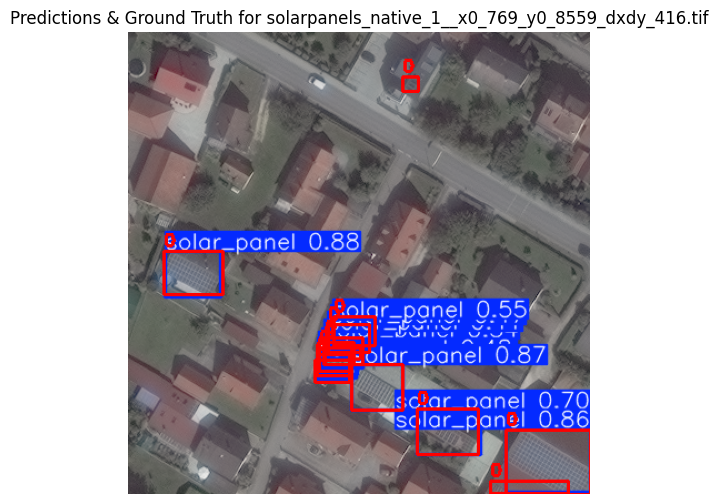
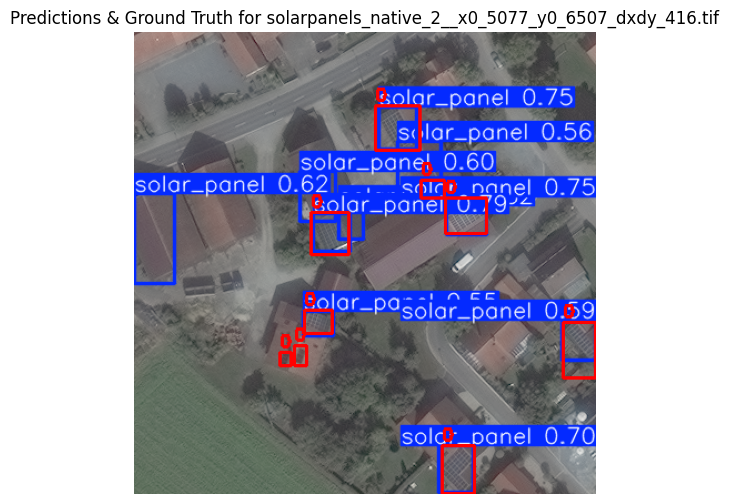
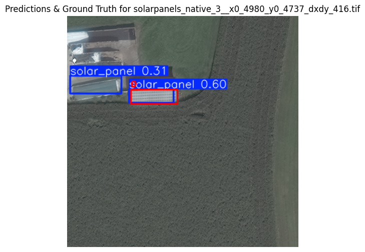
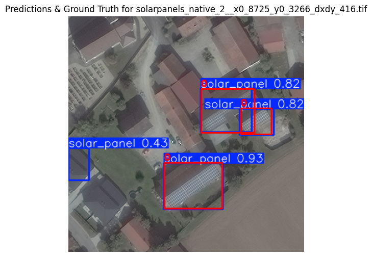
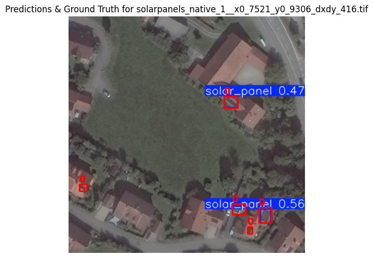

# Solar Panel Object Detection

This project focuses on detecting solar panels in satellite images using Ultralytics YOLO. Submitted by Anurag Singh, a first-year B.Tech student at IIT Gandhinagar.

Disclaimer: The mAP50 scores aren’t exceptional since I used the smallest YOLOv8 model, YOLOv8n (Nano), and trained it locally (then on google colab, since my kernel was dying again and again for some reason in jupyter-notebook).

----

## Folder Structure
- **srip_assignment.ipynb** - Contains all the code snippets about all the tasks as given in the selection task document.
---

## **Data Exploration and Understanding**

### 1️⃣ **Dataset Statistics**
- **Total solar panel instances**: Counted from labels (29625).
- **Distribution of labels per image**: Histogram created to show most images contain between 1 and 10 solar panels.

📌 **Plot:**  

---
### 2️⃣ **Solar Panel Area Analysis**  

- The **solar panel areas** were determined using bounding box dimensions, factoring in the dataset’s 31 cm resolution. A detailed breakdown can be found in the Jupyter Notebook.  

- **Mean area and variability**: The computed average solar panel area is **191.52 sq. m**, with a **standard deviation of 630.70 sq. m**, indicating significant variation in panel sizes.  

- **Size distribution**: A histogram was generated to illustrate the spread of solar panel sizes across the dataset.  

📌 **Histogram:**  




- It can be seen that most of the solar panels are on the smaller side of the spectrum and cluster around the mean value. Due to the high standard deviation, there are a significant number of outliers.
---


## **Implementing Fundamental Functions**

### 1️⃣ **Intersection over Union (IoU)**
- IoU was computed using **Shapely** and  **Supervision's IoU function**.
- Both methods gave same values for the example bounding boxes.

```python
bbox1 = (0.5,0.5,0.2,0.2)
bbox2 = (0.52,0.52,0.2,0.2)

iou_shapely = compute_iou(bbox1,bbox2)

bbox1_sv = np.array([bbox(bbox1)])
bbox2_sv = np.array([bbox(bbox2)])

iou_supervision = sv.box_iou_batch(bbox1_sv, bbox2_sv)[0][0]

print(f"IoU (Shapely): {iou_shapely:.4f}")
print(f"IoU (Supervision): {iou_supervision:.4f}")
```

```
IoU (Shapely): 0.6807
IoU (Supervision): 0.6807
```
---
### 2️⃣ **Average Precision (AP) Computation for Randomly Generated BBOX**
- Implemented three **AP computation methods**:
  - **Pascal VOC 11-point**
  - **COCO 101-point**
  - **Area under PR curve (AUC)**


```python
ap50_results = {"voc11": [],"coco101":[],"pr_auc":[]}

for i in range(num_img):
    ap50_results['voc11'].append(compute_ap50(ground_truth_boxes[i],predicted_boxes[i],predicted_confidences[i],method="voc11"))
    ap50_results['coco101'].append(compute_ap50(ground_truth_boxes[i],predicted_boxes[i],predicted_confidences[i],method="coco101"))
    ap50_results['pr_auc'].append(compute_ap50(ground_truth_boxes[i],predicted_boxes[i],predicted_confidences[i],method="pr_auc"))

mean_ap50 = {method : np.mean(scores) for method,scores in ap50_results.items()}

print(mean_ap50)
```
```
{'voc11': 0.5151082251082251, 'coco101': 0.47328618576143333, 'pr_auc': 0.46981150793650794}
```

The **AP50 metric** evaluates object detection models by measuring how well predictions align with ground truth labels at a 50% IoU threshold. We computed AP50 using three different methods:  

- **Pascal VOC 11-point interpolation**: Samples precision at only 11 recall points, smoothing fluctuations and often leading to a slightly higher AP.  
- **COCO 101-point interpolation**: Uses 101 recall points, offering a more detailed and stable estimate of precision across the recall range.  
- **Area Under the Precision-Recall Curve (AUC)**: Directly integrates under the precision-recall curve, making it the most precise but also the most unforgiving, as it accounts for every fluctuation in precision.  

Our results follow the expected pattern:  

$$AP_\text{VOC} \geq AP_\text{COCO} \geq AP_\text{AUC}$$  

confirming that our implementation is correct.  

## **Model Training**  
*Implemented in* `model.ipynb`  

### 1️⃣ **Data Splitting**  
- Applied an **80-20 train-test split**, with **10% of training data for validation**.  
- **Corrupted images** with incorrect labels were automatically filtered out during training.  

📌 **Data Distribution:**  
- Train: **1829** images  
- Validation: **204** images  
- Test: **509** images  

---  

### 2️⃣ **Training YOLO**  
- Used the **YOLOv8n** model for training.  
- **Hyperparameters:**  
  - **Image size**: 416x416  
  - **Batch size**: 8  
  - **Epochs**: 50  

📌 **Loss Convergence:**  
  

- The best model was automatically saved as **`best.pt`** after training.  
- The trained model was also exported in **ONNX format** for further deployment.  

---  

### 3️⃣ **Predictions & Visualizations**  
- Model predictions were **compared with ground truth** for evaluation.  
- Bounding box color coding:  
  - **Red** = Ground Truth  
  - **Blue** = Predictions  





  

---  

### 4️⃣ **mAP50 and Confusion Matrix Evaluation**  
- **mAP50** was computed using:  
  - **Supervision metrics**  
  - **Custom AP computation from scratch (as done for the randomly generated boxes above)**  

**Evaluation Results:**  

```
mAP50 (supervision): 0.2583
mAP50-95 (supervision): 0.1802
VOC11: 0.9487
COCO101: 0.9490
PR AUC: 0.9458
```

- The variation in scores highlights the differences in evaluation methodologies.  
- The **VOC 11-point method** provides a more generalized estimate, while the **COCO 101-point method** offers a finer granularity of precision-recall performance.  
- The **AUC method**, which integrates the entire precision-recall curve, offers the most detailed but strictest evaluation.  

---  

